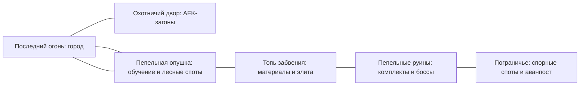

# Пепельный рубеж: постоянный мир, AFK и борьба за споты

Дата: 14 сентября 2026 года. Версия 0.2. **Рабочее направление продукта; конкретные правила и баланс остаются предложениями для проверки.** Пользователь разрешил двигаться к общей 3D-игре; это не означает, что все перечисленные ниже функции уже реализованы или все числа утверждены. Готовность описана в [STATUS.md](STATUS.md) и [GAME.md](GAME.md), порядок работы в разных чатах — в [WORKFLOW.md](WORKFLOW.md).

## 1. Направление и статус решений

**Обещание игроку:** «Развивай своего героя, пока занят. Когда возвращаешься — собирай друзей, охоться за редкими вещами и сражайся за лучшие места в мире».

Игра строится вокруг постоянного персонажа и знакомого общего мира. AFK поддерживает развитие, ручная игра открывает сильные сборки, а отношения между игроками создают историю сервера. Сессия может занимать пять минут для подготовки охоты или час для совместной вылазки.

Подтверждённые пожелания пользователя:

- Общий открытый мир, ориентир по ощущениям — MU Online; AFK-прокачка в загонах наподобие Stadium, полевые споты, боссы и экипировка.
- Воин, лучник и маг; ровно шесть слотов экипировки. Ручное распределение характеристик. PvP обязательно; PK рассматривается.
- Долговременное развитие и причины играть годами. В перспективе монетизация и, возможно, премиум.
- Браузер, 2.5D, настоящие 3D-модели, фиксированный ракурс с зумом. Нативные сборки сейчас не делать.
- Платежи не подключать до отдельного выбора провайдера. Существующий прогресс и другие сайты на сервере сохранять.

**Предложения этого документа:** конкретные правила AFK, уровни, прирост силы, PK и смерти, торговля, гильдии, цены/состав премиума и объём релизов. Пользователь ещё не утвердил их.

Раннее предложение делало центром игры вылазки с выносом временной добычи. В текущем направлении центр — постоянный мир со спотами. Вынос груза можно позже использовать в отдельном событии; для каждой обычной охоты он не нужен. [MVP_PLAN.md](MVP_PLAN.md) теперь указывает на этот единый план; ранняя версия сохранена во внешнем архиве.

## 2. Как механики работают вместе

| Занятие | Основная награда | Зачем менять занятие |
| --- | --- | --- |
| Загоны у города, AFK | Опыт, обычная экипировка, привязанный материал начального улучшения | Здесь нет уникальных свойств, боссовых ядер и рыночного заработка |
| Безопасный открытый мир | Материалы региона, золото, редкие основы вещей, репутация | Для другого предмета нужен другой спот; элита требует внимания |
| Пограничные споты | Более высокая плотность ценной добычи, удобный доступ к редким материалам | Можно потерять место из-за PvP, нужны союзники и подходящая сборка |
| Элитные враги и боссы | Уникальные эффекты, компоненты комплектов, внешний вид | Нужны механики боя и иногда группа; AFK этого не заменяет |
| Гильдейские конфликты | Престиж, оформление, временное владение аванпостом | Возникают соперники, общие цели и повод собраться |

Общий цикл: **подготовить сборку → выбрать спот → получить добычу → решить, что надеть, разобрать или продать → улучшить героя → освоить более сложную цель**.

Пример дня: утром игрок распределяет очки и отправляет героя в загон. Вечером меняет фарм-сборку на боевую, идёт за недостающим компонентом в топь, встречает знакомых, вместе убивает босса. Затем улучшает предмет и возвращается к спокойной прокачке. Другой игрок может провести вечер только в безопасном PvE; базовое развитие от этого не блокируется.

## 3. Мир и узнаваемость

Погасшие сторожевые огни оставили дороги и руины под властью пепельного заражения. Игроки восстанавливают рубеж, исследуют происхождение заражения и спорят за его ресурсы. Загоны — укреплённый охотничий двор у города, где егеря удерживают опасных существ и готовят бойцов. Это связывает тренировку, лесных животных, руины, боссов и будущие гильдейские аванпосты.

Сначала компактный мир, в котором часто встречаются люди. Пограничье — обозначенная часть руин, а не обязательная четвёртая большая карта. На карте видны рекомендуемая сила, тип добычи, правила PvP и состояние события. Основные безопасные маршруты имеют несколько выходов; пограничье можно обойти.

Дальние безопасные точки путешествия открываются исследованием. В бою мгновенного спасительного телепорта нет. Несколько каналов для всего мира не создаём заранее: это размоет небольшой онлайн. Дополнительная вместимость тренировочного двора допустима отдельно от единого полевого мира.

## 4. AFK, загоны и автоматическая охота

### Опыт игрока

AFK открывается после короткого обучения движению, бою, экипировке и распределению первых очков. Игрок выбирает подходящий загон и настраивает радиус охоты, основные навыки, порог лечения, фильтр подбора и условие остановки. Видит примерную доходность и расход расходников. Прогноз строится по его сборке, а не обещает одинаковый результат всем.

В официальном MU Helper уже есть автоматические навыки, лечение по порогу HP и фильтр подбора; это подходящий референс для понятной настройки, но наши правила наград и отключения самостоятельные. [Webzen: Auto Hunting Mode](https://muonline.webzen.com/en/gameinfo/guide/detail/35).

### Предлагаемые правила первой версии

- Автоохота бесплатна. Один одновременно работающий герой на аккаунт, включая открытые вкладки и отключённый клиент.
- В загоне персонаж может продолжать тренировку после закрытия браузера. Это заранее выбранная серверная сессия. Начальная гипотеза — до **8 часов за один запуск**, одинаково при открытом и закрытом браузере. Её можно завершить или запустить заново; это не ежедневная энергия. Продление за деньги не продаётся.
- Остановка наступает по таймеру, смерти, нехватке необходимых расходников либо заполнению предусмотренного хранилища. После остановки герой возвращается к безопасному входу. Нет автоматической череды платных/ресурсных воскрешений.
- При возвращении — отчёт: время, уровни, предметы, расход ресурсов, причина остановки. Награда начисляется сервером один раз; не зависит от часов устройства или перезагрузки вкладки.
- Загоны защищены от игроков. Монстры остаются угрозой: слишком тяжёлый загон или неудачная сборка прерывают охоту.
- Награда загона: XP, обычные/необычные вещи и **привязанные** тренировочные материалы. Эти вещи не продаются игрокам, не превращаются в рыночное золото и при разборе сохраняют привязку. Начальное лечение в тренировочном дворе обеспечивается его же непередаваемыми припасами.
- Полевой помощник может применять заданную ротацию и подбирать разрешённую добычу. Он не выполняет задания, не уворачивается от механик босса и не выбирает PvP-цели. При отключении вне загона герой после боевого таймера выходит из мира; офлайн-фарм спорного спота пока не делаем.
- Программа помощника никогда не начинает PK и не отвечает уроном на провокацию автоматически. Удар игрока отключает полевую автоохоту; AFK-персонаж не получает иммунитет в пограничье.

### Вместимость и честный фарм

Открытые загоны вмещают небольшие группы. У зоны есть бюджет появления монстров; добавление персонажей не умножает её суммарную добычу автоматически. Участие в убийствах, поддержка и уровень учитываются при награде, простаивание рядом её не даёт. Сильный персонаж не должен вытеснять новичков из их диапазона: у тренировочных секций есть ограничения по уровню и соответствующая доходность.

Для переполненного двора добавляется тренировочная секция той же эффективности, а не продаётся VIP-доступ к свободному месту. Совместный загон полезен для общения и освоения более трудной секции, но одиночке доступен нормальный темп развития.

Ограничение на аккаунт не решает проблему множества аккаунтов. Защита строится также на привязке AFK-наград, проверке подозрительных переводов в полевой экономике и серверных лимитах. Общий домашний IP сам по себе не означает нарушение.

## 5. Споты и активная игра

Спот — узнаваемое место с конкретным назначением. Не рассыпать одинаковых монстров по большой пустой карте.

| Пример | Бой | Причина прийти |
| --- | --- | --- |
| Волчьи логова на опушке | Частые небольшие стаи; ценен урон по площади | Кожа, ранние вещи, репутация егерей |
| Кабаний овраг | Меньше врагов, крепкая броня и опасный разбег | Компоненты защиты и улучшения брони |
| Затопленное святилище | Дальние атаки, яд, приоритет опасных целей | Материалы амулетов и свойства для навыков |
| Старая кузня в руинах | Элитные стражи, прерывания, бой группой | Основы комплектов и кузнечные компоненты |
| Пограничная жила | Открытый PvP, несколько подходов и маршрутов отхода | Ускоренный сбор востребованного материала |

Не каждый спот должен одновременно быть лучшим по XP, золоту и предметам. Игрок выбирает цель и сборку. Редкие разновидности врагов и небольшие события временно меняют приоритет мест, но постоянные ориентиры остаются знакомыми.

У ручного боя преимущества за счёт передвижения, прерываний, выбора целей, механик и доступа к событиям. Не пытаться отличать ручную игру от макроса только скоростью нажатий и выдавать за это скрытый множитель.

Начальная проверяемая цель: час внимательной полевой игры продвигает выбранную сборку заметнее, чем час в безопасном загоне. Обычный редкий комплект доступен без PvP; рискованный спот ускоряет добычу, а не удерживает единственный обязательный материал для всех игроков.

## 6. Персонажи, характеристики и сборки

Сохраняем три класса и шесть слотов: **оружие, броня, шлем, сапоги, кольцо, амулет**. Щит/колчан/книга могут входить в визуальный комплект оружия; седьмой слот не добавляется. Плащ, аура или будущие крылья используют косметический слой, не скрытый дополнительный источник характеристик.

Четыре распределяемые характеристики:

| Характеристика | Основное назначение |
| --- | --- |
| Сила | Силовые физические навыки, тяжёлое оружие и требования к части экипировки |
| Ловкость | Стрелковые навыки, скорость действий в ограниченном диапазоне, часть защитных свойств |
| Живучесть | Здоровье и выживаемость; выбор между уроном и запасом на ошибку |
| Энергия | Заклинания, ресурс и поддерживаемые энергией классовые эффекты |

Базовая гипотеза: 5 свободных очков за уровень. Рядом с распределением показывается конкретное изменение урона, HP, ресурса и скорости. До подтверждения можно отменить правки. Есть рекомендации для новичка, но распределение остаётся ручным. Сброс свободный во время обучения, позднее — за доступное игровое золото у наставника; не за донат.

Сила характеристик зависит от класса и навыка, а не от одного универсального множителя. Нужно проверять хотя бы две конкурентоспособные сборки каждого класса:

| Класс | Примеры направлений | Что отличает ручной бой |
| --- | --- | --- |
| Воин | Устойчивый боец с контролем; агрессивный боец с вихрем и рывком | Сближение, прерывание, направление удара и защита союзника |
| Лучник | Точный одиночный урон; мобильная охота с ловушками и залпом | Дистанция, препятствия, момент отхода и контроль прохода |
| Маг | Площадной урон; контроль и защитные барьеры | Расстановка областей, выбор цели, прерываемые сильные заклинания |

В завершённом MVP — по 6 классовых навыков, из которых 4 выбираются на панель, плюс обычная атака и зелье. Для первой проверки достаточно 3 навыков на класс. Все классы способны проходить базовый PvE и фармить самостоятельно; обязательного отдельного аккаунта-баффера нет.

Взаимодействия создают преимущество группы: воин удерживает врагов, маг накрывает область, лучник устраняет опасную дальнюю цель. Жёсткая тройка «танк/лекарь/урон» для каждого босса не требуется. Скорость, уклонение и контроль имеют ограничения; нельзя собрать постоянную неуязвимость или бесконечное оглушение.

Предложение по идентичности: после обучения класс закрепляется за героем, на аккаунте доступны три бесплатных персонажа. Внутри класса — минимум две бесплатные сохранённые сборки, переключение в городе вне боя. Это отличается от нынешней свободной смены класса у огня; менять поведение и переносить старых героев можно только отдельной реализацией с миграцией.

## 7. Прогресс на месяцы и годы

### Вертикальный рост с достижимой боевой базой

Для первого полного цикла предлагаем **60 уровней**. В раннем тесте открываем 20, затем расширяем при наличии соответствующего контента. Число уровней само по себе не обеспечивает длительности игры.

Первый понятный комплект должен появляться в первые несколько сессий. Рабочая гипотеза для боевого уровня и доступного редкого комплекта — 2–4 недели смешанной игры. Проверять по реальному режиму сессий, а не обещать одинаковый календарный срок всем. Новичок должен сравнительно быстро попасть в полезный групповой контент.

После базового предела — мастерство класса: открытие альтернативных модификаций навыков и ограниченного набора одновременно активных талантов. В MVP достаточно первого законченного слоя; большой набор ветвей добавляется позже. Очки мастерства не дают бесконечно растущую сумму HP и урона.

**Бесконечные ресеты с накоплением характеристик на старте не рекомендуются.** Они превращают отрыв по времени AFK в постоянный барьер PvP. Если нужны перерождения, позже можно испытать конечную цепочку пробуждений с новыми стилями/испытаниями и известным пределом силы. Не закладывать её сейчас как обязательный сброс героя.

### Длительные цели

- Несколько сборок для фарма, босса и PvP; редкие свойства и альтернативные комплекты.
- Коллекции внешности, трофеи боссов, бестиарий, мастерство конкретного оружия в пределах выбранного бюджета силы.
- Сложные версии испытаний с новыми механиками и косметическими наградами.
- Гильдейская репутация, аванпосты, отношения и история соперничества.
- Новые главы и регионы, добавляющие способы играть. Новый сезон не обязан полностью обесценивать старую экипировку.

Постоянный мир сохраняет героев и имущество без регулярных вайпов. Сезоны, например по 8–12 недель, обновляют рейтинги, цели и оформление. Это предложение ритма, не обещание объёма выпуска. Даты и частота определяются после измерения реальной скорости производства контента.

«Играть годами» означает поддерживать баланс, экономику, сообщество и выпускать изменения. Ни AFK, ни бесконечная шкала опыта сами по себе этого не гарантируют.

## 8. Экипировка и экономика

Предметы различаются тремя понятными слоями: основа и уровень, несколько свойств, улучшение. Редкость не равна только большей цифре атаки. На старте четыре категории: обычная, необычная, редкая, уникальная; комплектные свойства — отдельная метка, а не ещё одна валюта/шкала.

Примеры уникальных эффектов: вихрь подтягивает обычных монстров; после ручного отхода следующий выстрел пробивает цель; барьер при разрушении создаёт короткую зону замедления. Срабатывания ограничены и явно описаны; PvP-значения эффекта видны отдельно. Уникальные вещи меняют решение игрока, а не дают все лучшие характеристики сразу.

Комплекты на 2–3 предмета оставляют место для смешивания шести слотов. Внешность брони и оружия показывает рост героя; усиление добавляет сдержанные эффекты, не закрывающие силуэт и атаки.

Начальная заточка — до +6: +1…+3 гарантированны; +4…+6 могут расходовать материалы без успеха, но предмет не ломается и не понижается. Есть видимый накопительный прогресс до гарантии; конкретные шансы и бюджет попыток нужны в отдельной таблице до реализации. Не продавать улучшение шансов. Альтернатива для первого теста — полностью детерминированная заточка, если случайность не делает цикл интереснее.

| Источник | Куда уходит ценность |
| --- | --- |
| Полевое золото и контракты | Расходники, ремонт, сброс сборки, кузнец, комиссия торговли |
| Материалы спотов и разбор лишних вещей | Заточка, создание основы, замена выбранного свойства |
| Боссовые ядра/фрагменты | Конкретный комплект или гарантированный путь к желаемому уникальному предмету |
| Тренировочная добыча | Только личное начальное развитие; не переводится в рыночную ценность |

Используем золото и небольшое число материалов-предметов, а не отдельную валюту для каждого режима. Разбор уменьшает количество предметов; ремонт, услуги и комиссии выводят золото. Цены расходов сверяются с доходом обычного игрока, особенно после смерти: восстановление не должно запирать его в бедности.

Для полноценного социального MVP нужна простая торговая доска с фиксированной ценой: обычные полевые материалы и ненадетые редкие предметы. Надетое/улучшенное снаряжение привязывается, боссовые уникальные предметы и ядра — личные; они дают цель играть самому. Передача покупателю атомарна, комиссия и состояние предмета видны до покупки. Сначала без прямого обмена, ставок, свободной передачи золота и платной перепродажи косметики.

В первом игровом срезе торговлю не делаем; подключаем после сохранений, журнала выдач и проверки экономики. Рынок с малым онлайном — дополнение, а не единственный способ получить важный материал: остаются споты и NPC-конвертация по заранее известному курсу.

## 9. PvP, PK и последствия смерти

Три понятных контекста; цвет на карте дополняется текстом и значком, не является единственным сигналом.

| Место/режим | Кто может атаковать | Последствия |
| --- | --- | --- |
| Город, загоны, учебные и обычные PvE-маршруты | Только согласованная дуэль на площадке | Дуэль без потери предметов/опыта, восстановление участников |
| Пограничье со спотами | Игрок сознательно включает принудительную атаку | Самооборона без наказания, убийство мирного игрока даёт PK-статус |
| Объявленное событие за аванпост | Участники события с понятными сторонами/границами | Бой без PK-штрафа, очки за цели события |

На входе в пограничье впервые показываются правила; переход нельзя сделать случайно. Новички не появляются там при входе/возрождении, основные квесты туда не вынуждают. Поздний игрок всё ещё может спокойно заниматься PvE и AFK.

### PK как осознанный риск

Нападение на нейтрального игрока временно отмечает агрессора и даёт жертве/её текущей группе право защищаться. Убийство в самообороне не делает жертву преступником. Массовый навык и помощник не должны случайно начинать PK. Лечение отмеченного агрессора передаёт помощнику соответствующий боевой статус; отражение урона не превращает защищающегося в инициатора. Выход/вход в группу не очищает уже начатый конфликт.

За убийство мирного персонажа — красное имя и нарастающее бесчестье. Предлагаемые последствия: доступность для ответного нападения в пограничье, закрытый доступ к безопасным тренировкам до отработки статуса, более дорогой ремонт, отдельная точка возрождения на границе. Базовый продавец и путь к искуплению остаются доступными: игрок не должен оказаться без экипировки и возможности продолжить игру. В безопасных зонах нападения всё равно запрещены; город не становится лазейкой для убийств.

Бесчестье снимается активными заданиями искупления и подходящими по силе монстрами, без доната и без автоматического отмывания в загоне. Награды за убийство PK и публичную систему наград за голову сначала не вводим: это отдельный источник накрутки через знакомых/вторые аккаунты.

### Смерть и бой

- Надетые вещи, купленная внешность и постоянный инвентарь на первом этапе не выпадают. Уровень не теряется.
- В PvE — возвращение к огню, небольшой ремонт и потерянное время. В пограничье — возвращение к пограничному огню, ремонт и потеря контроля над спотом. Это уже ощутимая цена поражения.
- Собирать выпадающий груз можно в будущем отдельном событии с заранее указанными правилами. Полная потеря вещей не является правилом мира.
- Боевой выход: стартовая гипотеза 15 секунд присутствия после отключения; повторный вход возвращает то же состояние, без бесплатного лечения и сброса откатов. Плановая AFK-сессия в защищённом дворе — отдельное состояние, не способ уйти из PvP.
- Возрождение имеет краткую защиту до выхода/агрессивного действия, несколько маршрутов и блокировку немедленной повторной атаки из безопасной границы. Нельзя использовать защиту для нанесения урона.
- Убийства игроков не создают XP/золото из воздуха. Награды соревнования идут за удержание целей и участие с ограничениями против повторной накрутки.

В полевом PvP уровень, предметы и сборка имеют значение. Их общая сила ограничена прогрессией, а PvP-множители, пределы контроля и эффективность лечения настроены отдельно. Для честной тренировки есть вариант дуэли с одинаковым бюджетом характеристик; массовые рейтинговые очереди пока не нужны.

Тестовая цель для сопоставимых сборок: бой оставляет время заметить нападение и принять несколько решений; ориентир 8–20 секунд до поражения в обычном 1×1, а не гарантированное попадание в точное число. Измерять по каждой паре классов; превосходство группы над одиночкой не пытаться полностью отменить скрытым масштабированием.

## 10. Боссы, квесты и события

Три масштаба PvE: элита на споте для одного/пары игроков, региональный босс для небольшой группы, более редкое общее событие. Сложность появляется из атак и целей, а не только из запаса здоровья.

Первые примеры: Седой вожак с призывом стаи; Хранитель разлома с разрушаемыми печатями и направленными ударами. Волк/кабан/вожак уже есть в общей серверной 3D-опушке. Призыв стаи, Хранитель и остальные описанные здесь механики боссов — будущая работа.

Обычный босс появляется после местного события/призыва, чтобы малый онлайн мог его встретить. Большая битва заранее объявляется и имеет несколько окон в разные часы. Награда учитывает реальное участие, защиту/поддержку и механику, а не последний удар. Нельзя бесконечно увеличивать общий выпуск добычи набором неучаствующих персонажей. После нескольких побед фрагменты позволяют целенаправленно собрать желаемую вещь, а не зависеть только от случайного выпадения.

Первый набор квестов — около 12 вручную сделанных задач:

- Знакомство с лагерем, первое оружие, характеристики и пробная автоохота.
- Поиск пропавшего патруля, следы заражения, обследование троп и возвращение безопасного прохода.
- Охота на элиту, первый босс, восстановление сторожевого огня и открытие следующей области.

Доска предлагает несколько контрактов на выбор: добыча материала, охота на конкретный вид, сопровождение или событие. Не заставлять закрывать длинный ежедневный список. Групповой результат засчитывается участвовавшим игрокам; AFK-убийства не выполняют активные сюжетные задачи автоматически.

На старте достаточно одного повторяемого события: нападение на огонь или ритуал в руинах. Потом можно добавить караван и отдельное испытание на волны. Не строить сразу календарь из десятка обязательных режимов.

## 11. Сообщество и возвращаемость

Группа до 5 игроков, список друзей, общий и групповой чат, игнор/жалоба. Поиск группы привязан к конкретному боссу или споту. Общение и приглашение доступны прямо из мира.

В завершённом MVP — простые гильдии: название, эмблема, участники, роли и чат. Общее хранилище и сложные права предметов откладываем. На следующем этапе — один аванпост с объявленным временем борьбы. Владение даёт оформление, трофеи и услуги гильдии, но не постоянный процент урона или право закрыть весь мир для остальных.

Одна малая группа должна иметь полезные цели, даже когда на сервере нет сотен людей. Сначала собираем аудиторию в одном мире и вокруг одного события. Гильдейские войны, осады и отдельные очереди открываем по фактической одновременной активности, а не по числу зарегистрированных аккаунтов.

Причины вернуться: сегодня закончить предмет; на неделе пройти босса/попробовать сборку; за месяц собрать комплект/получить узнаваемый титул; дальше — друзья, соперники, коллекции и новые главы. За пропуск нескольких дней награда не должна превращаться в долг обязательных заданий.

## 12. Монетизация

Базовая игра, AFK-помощник, PvP и полноценные сборки бесплатны. Кандидаты на продажу: облики классов и оружия, анимации города/эмоции, оформление гильдии и законченный набор поддержки.

Премиум возможен после проверки повторной ценности: косметический бонус, расширенный архив внешности, дополнительные вкладки банка при достаточном бесплатном объёме. Две рабочие сборки бесплатны. Премиум не добавляет часы/персонажей AFK, опыт, дроп, характеристики, удачу заточки или право снимать PK. По окончании дополнительное хранилище доступно для извлечения, вещи не исчезают.

Это осознанный коммерческий риск: без продажи силы потребуется аудитория, которой нравится герой и общество игры. Доходность такого подхода не подтверждена. Сначала проверяем возвращаемость и интерес к конкретной готовой косметике; точные цены и провайдер не выбраны. **Платёжные интеграции сейчас не делать.**

## 13. Размер первого законченного продукта

| Часть | Маленький игровой срез | Завершённый MVP после проверки среза |
| --- | --- | --- |
| Мир | Лагерь, двор с 3 тестовыми загонами, опушка с 3 спотами | Один город, 6 загонов, 3 небольшие природные/руинные области с 9 спотами суммарно; пограничье внутри руин |
| Герои | 3 класса, 20 уровней, ручные статы, 3 навыка на класс | 60 уровней, 6 навыков на класс/4 на панели, первая ограниченная система мастерства |
| Предметы | 6 слотов, понятные редкие свойства, базовое улучшение | Примерно 24 основы вещей, 6 уникальных эффектов, 3 набора комплектных свойств |
| Контент | Короткое обучение, 1 босс, 1 контракт | Около 12 сюжетных задач, доска контрактов, 3 типа элиты, 2 босса, 1 повторяемое событие |
| AFK | Серверная сессия, отключение/возврат, отчёт | Настройки, вместимость, учёт экономики и защиты от злоупотреблений |
| PvP | Дуэли и одна проверка спота с обозначенной границей | Пограничье, агрессия/самооборона/PK, безопасное возрождение |
| Социальное | Общий чат и группа | Друзья, гильдии без осад, игнор/жалоба, простая торговая доска |
| Надёжность | Общий 3D-мир, аккаунт и сохранения | Транзакции предметов, восстановление резервной копии, мониторинг, тест длительного AFK и нагрузки |

Количество основ вещей не равно количеству новых 3D-моделей: часть использует общую геометрию и материалы. У трёх классов должен быть узнаваемый силуэт; сначала доводим три комплекта и читаемость боя, затем расширяем библиотеку.

Вне первого MVP: осады больших замков, огромная бесшовная карта, профессии с отдельными деревьями, десятки классов, питомцы с характеристиками, дополнительная экипировка поверх шести слотов, бесконечные ресеты, рейтинговые очереди нескольких форматов, мобильные/настольные сборки. Офлайн-торговые лавки и ремесло можно оценить после запуска простой доски.

## 14. Порядок разработки и критерии перехода

Обновление реализации 14 сентября: старый пиксельный клиент и локальная 3D-симуляция объединены в один браузерный 3D-клиент с общим авторитетным сервером. Работают три класса, шесть слотов, бой, личная добыча, первая задача и JSON-сохранения версии 2. Два клиента совместно бьют босса; переподключение и штатный рестарт сохраняют прогресс. Полноценных аккаунтов пока нет — используется секретный ключ героя. Текущий лимит 16 — ограничение кода, не доказанная вместимость. Ручные статы, AFK, PK, рынок и гильдии не реализованы. Технический статус и публичные проверки — в GAME.md, QA.md и DEPLOYMENT.md.

| Этап | Результат | Переход дальше |
| --- | --- | --- |
| 1. Общая основа | Перенос 3D-клиента на единый авторитетный сервер; карта/движение/бой; аккаунт и сохранения | Два браузера видят одних врагов, совместно бьют босса; предмет/HP/откат корректны после переподключения и рестарта |
| 2. Развитие и AFK | Три класса в 3D, статы, предметы, первые загоны и серверная автоохота | Игрок выбирает сборку и загон; закрывает браузер, возвращается к корректному результату; активный фарм имеет отдельную ценность |
| 3. Конфликт | Дуэли, полевой спот, PK/самооборона/выход/возрождение | Несколько реальных игроков проверяют каждый класс; проигравший возвращается играть, обхода смерти и безопасного урона с границы нет |
| 4. Цельный мир | Три области, боссы, квестовая цепочка, партии и гильдии | Работает полный цикл от новичка до первой законченной сборки; полезные цели есть при малом онлайне |
| 5. Экономика и закрытая альфа | Торговая доска, журнал выдач/расходов, модерация и инструменты баланса | Нет дубликатов при сбоях/повторных запросах; понятны источники золота и предметов; проверены бэкап/восстановление и длительная нагрузка |
| 6. Коммерческий запуск | Готовая косметика и премиум при подтверждённом интересе | Только после отдельного выбора провайдера: покупки/права/возвраты проверены и сохранены |

Не объединять экономические значения двух прототипов механическим копированием. Визуальные метры и серверные координаты, дальность/скорость и момент попадания должны иметь единые определения. Модели и клипы из Blender/Mixamo остаются в браузерном клиенте; сервер определяет исход боя, анимация его показывает.

Общая 3D-опушка и сохранения реализованы. Для закрытия всей основы продукта остаются полноценные аккаунты и усиление хранилища перед экономикой. Следующий игровой шаг — ручные статы, сборки и первый AFK-загон по этапу 2.

## 15. Надёжность AFK и экономики

Это требования реализации, не дополнительные экраны для игрока:

- Сохранять аккаунты, героев, предметы и операции в транзакционном хранилище; для планируемого рынка/покупок предлагаем PostgreSQL. Старый прогресс переносить отдельной проверяемой миграцией.
- Один владелец симуляции героя: активная сессия или AFK-задача. Переподключение переводит управление, а не создаёт вторую копию фарма.
- Постоянные идентификаторы выдач и операций, идемпотентность повторных запросов, атомарность денег/вещей. Откат, рестарт или повторное получение отчёта не создают награду заново.
- AFK-расчёт и таймеры выполняются на сервере. На первом этапе не начислять награды за время, когда сервер был остановлен: это явно отражается в отчёте. Дальнейшая компенсация — отдельное правило, не скрытая выдача по клиентскому времени.
- Отдельно измерять активных игроков, открытые подключения и серверные AFK-сессии. AFK-персонажи не должны занять весь бюджет, из-за чего невозможно войти в живую игру.
- Сетевые обновления только нужным наблюдателям; локальная детализация/анимация вдали снижается. Для ненаблюдаемых безопасных секций допустима более редкая симуляция после проверки эквивалентности наград.
- До расширения онлайна проверять смешанную нагрузку: активный бой, боссы, сохранения и длительные AFK-сессии. Число поддерживаемых игроков объявлять по измерению, а не по установленному лимиту.

## 16. Что проверять на живых игроках

Начать с приглашённой небольшой группы, затем расширять закрытую альфу волнами. Метрики разделять по режиму игры и дате прихода; свои тестовые аккаунты исключать.

| Вопрос | Наблюдение | Когда менять дизайн |
| --- | --- | --- |
| Игрок понимает, ради чего фармит? | Первая надетая вещь, распределённые статы, выбранная следующая цель | Если только нажимает AFK и не может назвать желаемый предмет |
| AFK дополняет игру? | Доля игроков, вернувшихся после AFK и совершивших активную вылазку | Если растут только автоматические часы, а активные сессии исчезают |
| Классы/сборки различаются полезно? | Доходность равных по силе сборок, выживаемость, выбор игроков | Если один класс всегда лучший и для AFK, и для босса, и для PvP |
| PK создаёт конфликт без вытеснения аудитории? | Возврат проигравших через 1/7 дней, повторные убийства у выхода, жалобы | Если PK стабильно выталкивает новых игроков из мира |
| Экономика живёт? | Выпуск/расход золота, источники предметов, завершённые продажи, доступность нужного ресурса | Если AFK/альты кормят рынок, золото растёт без расхода или важный товар монополизирован |
| Есть социальная причина вернуться? | Повторные группы, друзья, совместные цели | Если игроки месяц находятся рядом, но не взаимодействуют |
| Игра выдерживает длительность? | Сессии до 8 часов, повторное подключение, рестарт, восстановление | Любая потеря/дублирование имущества блокирует расширение теста |

Наблюдать обычные D1/D7/D30 по завершённым когортам и отдельно возврат к ручной игре. Одной цифры «онлайн» при включённом AFK недостаточно. Рыночные/отраслевые ориентиры здесь не заявлены; цели удержания ставятся после первых когорт.

## 17. Решения для следующих обсуждений

Рабочие рекомендации уже выбраны выше, поэтому проект не блокируется анкетой. Перед реализацией соответствующего этапа нужно явно зафиксировать:

1. AFK при закрытом браузере только в загонах; 8 часов за запуск как первая проверка, без платного продления.
2. Предел 60 уровней и ограниченное боевое мастерство; бесконечные ресеты с накоплением статов не закладываем.
3. PK только в обозначенном пограничье; в первой версии без выпадения надетых вещей и постоянного инвентаря.
4. Три отдельных героя по классам после обучения вместо нынешней неограниченной смены класса у огня.
5. Полевые материалы/ненадетые редкие вещи торгуются, тренировочные награды и боссовые уникальные вещи привязаны.

Пользователь разрешил дальнейшую разработку и общую серверную 3D-основу. Этот список всё ещё содержит проектные гипотезы; согласие с направлением не подменяет принятие конкретных правил PK, AFK и экономики. Принятые решения фиксируются в документе и соответствующем PR.

## Источники и границы заимствования

- [Webzen: Auto Hunting Mode](https://muonline.webzen.com/en/gameinfo/guide/detail/35), просмотрено 14.09.2026: подтверждает настройку автолечения, навыков и подбора предметов. Не используется как доказательство предложенного нами офлайн-режима.
- [Webzen: Stat Specialization](https://muonline.webzen.com/en/gameinfo/guide/detail/47), просмотрено 14.09.2026: пример зависимости классовых бонусов от распределённых характеристик. Наши четыре стата, формулы и ограничения — самостоятельное предложение.
- Stadium здесь означает пользовательский референс пространства с загонами. Правила конкретного частного MU-сервера не выдаются за универсальные правила официальной MU Online.

Документ опирается на пожелания пользователя и текущий проект. Все выводы о вовлечении, балансе и монетизации — проверяемые проектные гипотезы, а не гарантии коммерческого успеха.
