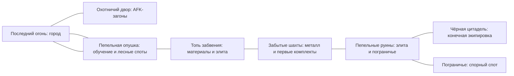

# Пепельный рубеж: постоянный мир, AFK и борьба за споты

## Принято 18 сентября: звук

По запросу пользователя в игру добавлены готовые бесплатные эффекты (CC0, MP3). Браузер не выдаёт отдельное разрешение: нужен первый клик. Музыка не входит. Громкость выключается кнопкой и клавишей M.

## Принято 18 сентября: компактные окна героя

По запросу пользователя окна характеристик и снаряжения выше, без верхних подписей и абзаца про стиль класса. Характеристики: слева статы, справа боевые показатели.

## Принято 18 сентября: заточка у кузнеца

По запросу пользователя заточка — игровое усиление, не только свечение примерки. Материалы фармятся, золото только сопутствующая плата. +1…+3 всегда удаются, +4…+6 с шансом 80%, +7…+9 — 60%. Неудача сбрасывает заточку на +0, камень и золото сгорают. До +6 нужен оселок, дальше закалённый слиток. Стадион ничего не роняет, включая камни. Автоохота всегда подбирает камни. Боевой бонус — +2% основной характеристики слота за уровень заточки.

## Принято 17 сентября: дроп на все классы

С мобов падают вещи любого класса. На предмете всегда виден класс; если он не совпадает с героем — красным и явно нельзя надеть. Качество на земле не дублируется в названии: его даёт цвет.

## Принято 17 сентября: AFK выбирает одну атаку и бафы по откату

По запросу пользователя автоохота больше не ранжирует все навыки одним списком. Игрок указывает один атакующий навык и отмечает, какие бафы держать включёнными. Включённый баф уходит в бой сразу по окончании отката, пока его эффект или зона не активны. Обычный удар остаётся запасным вариантом. Перемещения по-прежнему не входят в автоохоту.

## Уточнение управления и массовых навыков — 16 сентября 2026

ЛКМ по земле поддерживает оба режима: короткий клик оставляет маршрут до точки, удержание от 180 мс переключает на непрерывное движение в сторону текущего курсора. Отпускание после удержания останавливает движение; наведение без нажатия не меняет маршрут короткого клика. Shift + ЛКМ остаётся атакой на месте, ЛКМ по врагу — сближением и обычной атакой.

По последнему запросу пользователя «Землетрясение», «Град стрел» и «Чародейская нова» не имеют кулдауна. Повтор доступен после завершения самой атаки при достаточной мане. Уровень 20, радиус, урон, предел целей и расход 28/30/32 MP сохранены. Прежний кулдаун этих трёх навыков из сохранения обнуляется при загрузке; откаты остальных навыков сохраняются.

Предыдущий пакет отправлен на GitHub до коммита `b205ab3`. По новому запросу пользователя уточнение включается в `main` вместе с накопленными изменениями порталов и управления. Production не обновлялся. Проверки — QA.md.

## Принято 16 сентября: порталы и управление мышью

Последующий запрос пользователя заменяет прежнее управление удержанием ЛКМ: клик по земле — серверный путь в точку, клик по врагу — сближение и обычные удары, Shift + ЛКМ — удар на месте. ПКМ становится пятым слотом навыка; пробел подбирает один ближайший личный объект. Бег переключается R. Пять слотов, применение сборок и талантов во время боя и по одному широкому AoE на 20 уровне каждому классу — принятые изменения, а не будущие гипотезы.

Платные порталы связывают город и начала всех локаций с небольшими безопасными площадками. Доступ по уровню сохраняется. Цена определяется назначением и показана до клика; списание и переход атомарны в симуляции сервера. Бесплатное возвращение в город остаётся альтернативой с пятисекундным прерываемым ожиданием. Для уменьшения переполнения рюкзака зелёные вещи обычных мобов сокращены в пять раз, белые появляются крайне редко. Таблица редкостей и баланс новых навыков описаны в документах реализации этого пакета.

## Принято 16 сентября: удобство боя и перемещения

По запросу пользователя распределение свободных статов и смена экипировки доступны в бою; бесплатный сброс статов и изменение сборки навыков/талантов по-прежнему выполняются в безопасной зоне. Выходы подземелий расположены у входа и за финальной ареной. Возврат в город к стартовому костру занимает 5 секунд вне боя, прерывается движением/атакой/нападением, отменяется повторным нажатием; это не мгновенный способ избежать боя. Миникарта показывает споты, переходы, подземелья и элитных врагов без обычных мобов. Готовность зелий видна по счётчику и подсветке; названия добычи можно скрыть через Z. Список «Онлайн» показывает только подключённых героев со всего мира с уровнем и локацией. Игровые окна оставляют место над нижними барами, сохраняя кнопки действий доступными. Текущая реализация и ограничения проверки — в GAME.md и QA.md.

## Принято 16 сентября: мир до 100 и общие подземелья

Семь полевых регионов с порогами1/10/25/40/55/70/85; максимум героя100. На каждой карте общее подземелье с элитными стражами и боссом. Только боссы дают жёлтое и сетовое; элиты — зелёное/синее. 21 классовый набор с небольшими бонусами за2/4 предмета оставляет место для смешанных сборок. Поздние комплекты получают отдельную геометрию. Заточка согласована только как визуальная подготовка: возрастающее свечение и цвет набора, правила усиления будут выбраны позже. Длительность90дней остаётся гипотезой баланса, не гарантией контента. Готовое поведение: [STATUS](STATUS.md), [подземелья](docs/DUNGEONS.md), [вещи](docs/EQUIPMENT_100.md).

Дата: 15 сентября 2026 года. Версия 0.3. **Рабочее направление продукта; конкретные правила и баланс остаются предложениями для проверки.** Пользователь разрешил двигаться к общей 3D-игре; это не означает, что все перечисленные ниже функции уже реализованы или все числа утверждены. Готовность описана в [STATUS.md](STATUS.md) и [GAME.md](GAME.md), порядок работы в разных чатах — в [WORKFLOW.md](WORKFLOW.md).

**Принято и реализовано локально 16 сентября:** по 12 навыков на класс и четыре выбранных на 1–4; открытие по уровню, отдельные таланты и три сохраняемых пресета. В каждой из трёх веток класса пять малых талантов по два ранга и один итоговый; всего 54 определения. Бюджет — одно очко с 10 уровня, затем каждые четыре, максимум 20 к 86. Итоговый требует восемь очков ветки, одновременно разрешён один. Бесплатная смена в безопасной зоне снимает собственные бафы и сохраняет откаты; само открытие книги не прерывает бой/AFK. Историческое [предложение](docs/SKILL_BUILDS_PROPOSAL.md) заменено действующим [серверным контрактом](docs/SKILL_BUILDS_SERVER.md). Первичная проверка классов — [SKILL_BALANCE_ALPHA](docs/SKILL_BALANCE_ALPHA.md); PvP и экономика ещё не сбалансированы окончательно.

**Текущий игровой мир:** лес, снег с 10 уровня, Пепельные пустоши с 25 уровня и отдельный Стадиум. Третья полевая область 160 × 160 м содержит 98 мобов четырёх новых видов, восемь спотов и две элиты. Это реализованная цепочка регионов; маршрут через топь/шахты ниже остаётся прежней гипотезой будущего расширения. [Пустоши](docs/WASTELANDS.md).

**Прогресс снаряжения:** по полному комплекту из шести слотов на класс для 10 и 25 уровней, помимо прежнего первого уровня. 36 новых основ и 36 редких версий доводят каталог до 132 определений (66 зелёных / 66 синих). Пулы добычи привязаны к лесу, снегу и пустошам; Стадиум даёт лесной пул. Пока это обычные характеристики, случайные броски и визуальные варианты материалов существующих моделей, без бонусов полного набора и изменений навыков от вещей. [Региональные коллекции](docs/REGIONAL_EQUIPMENT.md).

Код использует PostgreSQL schema 6; общий 4732 и опубликованная игра остаются на schema 4. Реальная настройка Google OAuth ожидается. Остальные долгосрочные предложения ниже не становятся реализованными от этих локальных изменений.

## 1. Направление и статус решений

**Обещание игроку:** «Развивай своего героя, пока занят. Когда возвращаешься — собирай друзей, охоться за редкими вещами и сражайся за лучшие места в мире».

Игра строится вокруг постоянного персонажа и знакомого общего мира. AFK поддерживает развитие, ручная игра открывает сильные сборки, а отношения между игроками создают историю сервера. Сессия может занимать пять минут для подготовки охоты или час для совместной вылазки.

Подтверждённые пожелания пользователя:

- Уточнение 16 сентября: HP регенерирует и в бою, втрое медленнее. Четыре размера зелий каждого ресурса, до 999 в стопке, покупка по 1/50. Числа и протокол — [POTION_TIERS.md](docs/POTION_TIERS.md).

- Уточнение 15 сентября: онлайн-AFK включается в любой допустимой точке и атакует с места, без привязки к спотам и без погони за мобами/добычей. Споты и загоны остаются местами плотного появления противников. Привязанные предметы разрешено продавать торговцу.
- Уточнение 17 сентября: рюкзак и сундук начинают с 16 и 32 ячеек; дополнительные покупаются по одной за золото из плюса в конце сетки, до 40 и 64. Ячейки рюкзака, сундука и торговца одинакового уменьшенного размера.
- Уточнение 15 сентября: бутылки HP/MP лежат стопками в общем рюкзаке на 16 ячеек; Q/W назначаются перетаскиванием любого вида, а AFK использует только назначенное зелье нужного ресурса. Сохранённые количества старых героев и уже полные рюкзаки сохраняются при миграции, новое переполнение запрещено. [Реализация](docs/CONSUMABLE_INVENTORY_SERVER.md).
- Общий открытый мир, ориентир по ощущениям — MU Online; AFK-прокачка в загонах наподобие Stadium, полевые споты, боссы и экипировка.
- Воин, лучник и маг; ровно шесть слотов экипировки. Ручное распределение характеристик. PvP обязательно; PK рассматривается.
- Долговременное развитие и причины играть годами. В перспективе монетизация и, возможно, премиум.
- 2.5D, настоящие 3D-модели, фиксированный ракурс с зумом. 15 сентября выбраны Three.js + TypeScript и браузер как основная версия, desktop — на том же веб-клиенте. Мобильная версия остаётся возможным последующим направлением. Проба Godot удалена из рабочего проекта. Переход на строгий TypeScript выполнен; [технологическое направление](TECHNICAL_DIRECTION.md).
- Платежи не подключать до отдельного выбора провайдера. Существующий прогресс и другие сайты на сервере сохранять.

Уточнение 15 сентября: пользователь выбрал ориентир 2–3 часа активной игры в день плюс AFK, вещи со статами без модификаций навыков, скорость атаки/каста и примерно три месяца развития. Новый численный состав предложен в [MVP_90_DAYS.md](MVP_90_DAYS.md); он заменяет ранний вариант на 60 уровней и три области. Остальные параметры остаются гипотезами.

**Предложения этого документа:** конкретные правила AFK, уровни, прирост силы, PK и смерти, торговля, гильдии, цены/состав премиума и объём релизов. Пользователь ещё не утвердил их.

Раннее предложение делало центром игры вылазки с выносом временной добычи. В текущем направлении центр — постоянный мир со спотами. Вынос груза можно позже использовать в отдельном событии; для каждой обычной охоты он не нужен. [MVP_PLAN.md](MVP_PLAN.md) теперь указывает на этот единый план; ранняя версия сохранена во внешнем архиве.

## 2. Как механики работают вместе

| Занятие | Основная награда | Зачем менять занятие |
| --- | --- | --- |
| Загоны у города, AFK | Опыт, обычная экипировка, привязанный материал начального улучшения | Здесь нет уникальных свойств, боссовых ядер и рыночного заработка |
| Безопасный открытый мир | Материалы региона, золото, редкие основы вещей, репутация | Для другого предмета нужен другой спот; элита требует внимания |
| Пограничные споты | Более высокая плотность ценной добычи, удобный доступ к редким материалам | Можно потерять место из-за PvP, нужны союзники и подходящая сборка |
| Элитные враги и боссы | Уникальные эффекты, компоненты комплектов, внешний вид | Нужны механики боя и иногда группа; AFK этого не заменяет |
| Гильдейские конфликты | Престиж, оформление, временное владение аванпостом | Возникают соперники, общие цели и повод собраться |

Общий цикл: **подготовить сборку → выбрать спот → получить добычу → решить, что надеть, разобрать или продать → улучшить героя → освоить более сложную цель**.

Пример дня: утром игрок распределяет очки и отправляет героя в загон. Вечером меняет фарм-сборку на боевую, идёт за недостающим компонентом в топь, встречает знакомых, вместе убивает босса. Затем улучшает предмет и возвращается к спокойной прокачке. Другой игрок может провести вечер только в безопасном PvE; базовое развитие от этого не блокируется.

## 3. Мир и узнаваемость

Погасшие сторожевые огни оставили дороги и руины под властью пепельного заражения. Игроки восстанавливают рубеж, исследуют происхождение заражения и спорят за его ресурсы. Загоны — укреплённый охотничий двор у города, где егеря удерживают опасных существ и готовят бойцов. Это связывает тренировку, лесных животных, руины, боссов и будущие гильдейские аванпосты.

Мир делится на компактные области с понятными маршрутами. Для полного MVP предложены город, пять полевых регионов, два небольших подземелья и одна арена — девять пространств; подробный состав в [MVP_90_DAYS.md](MVP_90_DAYS.md). Пограничье находится внутри руин и не считается дополнительной картой. На карте видны рекомендуемая сила, тип добычи, правила PvP и состояние события. Основные безопасные маршруты имеют несколько выходов; пограничье можно обойти.

Дальние безопасные точки путешествия открываются исследованием. В бою мгновенного спасительного телепорта нет. Несколько каналов для всего мира не создаём заранее: это размоет небольшой онлайн. Дополнительная вместимость тренировочного двора допустима отдельно от единого полевого мира.

## 4. AFK, загоны и автоматическая охота

### Опыт игрока

AFK открывается после короткого обучения движению, бою, экипировке и распределению первых очков. Игрок выбирает подходящий загон и настраивает радиус охоты, основные навыки, порог лечения, фильтр подбора и условие остановки. Видит примерную доходность и расход расходников. Прогноз строится по его сборке, а не обещает одинаковый результат всем.

В официальном MU Helper уже есть автоматические навыки, лечение по порогу HP и фильтр подбора; это подходящий референс для понятной настройки, но наши правила наград и отключения самостоятельные. [Webzen: Auto Hunting Mode](https://muonline.webzen.com/en/gameinfo/guide/detail/35).

### Предлагаемые правила первой версии

- Автоохота бесплатна. Один одновременно работающий герой на аккаунт, включая открытые вкладки и отключённый клиент.
- В загоне персонаж может продолжать тренировку после закрытия браузера. Это заранее выбранная серверная сессия. Начальная гипотеза — до **8 часов за один запуск**, одинаково при открытом и закрытом браузере. Её можно завершить или запустить заново; это не ежедневная энергия. Продление за деньги не продаётся.
- Остановка наступает по таймеру, смерти, нехватке необходимых расходников либо заполнению предусмотренного хранилища. После остановки герой возвращается к безопасному входу. Нет автоматической череды платных/ресурсных воскрешений.
- При возвращении — отчёт: время, уровни, предметы, расход ресурсов, причина остановки. Награда начисляется сервером один раз; не зависит от часов устройства или перезагрузки вкладки.
- Загоны защищены от игроков. Монстры остаются угрозой: слишком тяжёлый загон или неудачная сборка прерывают охоту.
- Награда загона: XP, обычные/необычные вещи и **привязанные** тренировочные материалы. Эти вещи не продаются игрокам, не превращаются в рыночное золото и при разборе сохраняют привязку. Начальное лечение в тренировочном дворе обеспечивается его же непередаваемыми припасами.
- Полевой помощник может применять заданную ротацию и подбирать разрешённую добычу. Он не выполняет задания, не уворачивается от механик босса и не выбирает PvP-цели. При отключении вне загона герой после боевого таймера выходит из мира; офлайн-фарм спорного спота пока не делаем.
- Программа помощника никогда не начинает PK и не отвечает уроном на провокацию автоматически. Удар игрока отключает полевую автоохоту; AFK-персонаж не получает иммунитет в пограничье.

### Вместимость и честный фарм

Открытые загоны вмещают небольшие группы. У зоны есть бюджет появления монстров; добавление персонажей не умножает её суммарную добычу автоматически. Участие в убийствах, поддержка и уровень учитываются при награде, простаивание рядом её не даёт. Сильный персонаж не должен вытеснять новичков из их диапазона: у тренировочных секций есть ограничения по уровню и соответствующая доходность.

Для переполненного двора добавляется тренировочная секция той же эффективности, а не продаётся VIP-доступ к свободному месту. Совместный загон полезен для общения и освоения более трудной секции, но одиночке доступен нормальный темп развития.

Ограничение на аккаунт не решает проблему множества аккаунтов. Защита строится также на привязке AFK-наград, проверке подозрительных переводов в полевой экономике и серверных лимитах. Общий домашний IP сам по себе не означает нарушение.

## 5. Споты и активная игра

Спот — узнаваемое место с конкретным назначением. Не рассыпать одинаковых монстров по большой пустой карте.

| Пример | Бой | Причина прийти |
| --- | --- | --- |
| Волчьи логова на опушке | Частые небольшие стаи; ценен урон по площади | Кожа, ранние вещи, репутация егерей |
| Кабаний овраг | Меньше врагов, крепкая броня и опасный разбег | Компоненты защиты и улучшения брони |
| Затопленное святилище | Дальние атаки, яд, приоритет опасных целей | Материалы амулетов, мана и восстановление |
| Старая кузня в руинах | Элитные стражи, прерывания, бой группой | Основы комплектов и кузнечные компоненты |
| Пограничная жила | Открытый PvP, несколько подходов и маршрутов отхода | Ускоренный сбор востребованного материала |

Не каждый спот должен одновременно быть лучшим по XP, золоту и предметам. Игрок выбирает цель и сборку. Редкие разновидности врагов и небольшие события временно меняют приоритет мест, но постоянные ориентиры остаются знакомыми.

У ручного боя преимущества за счёт передвижения, прерываний, выбора целей, механик и доступа к событиям. Не пытаться отличать ручную игру от макроса только скоростью нажатий и выдавать за это скрытый множитель.

Начальная проверяемая цель: час внимательной полевой игры продвигает выбранную сборку заметнее, чем час в безопасном загоне. Обычный редкий комплект доступен без PvP; рискованный спот ускоряет добычу, а не удерживает единственный обязательный материал для всех игроков.

## 6. Персонажи, характеристики и сборки

Сохраняем три класса и шесть слотов: **оружие, броня, шлем, сапоги, кольцо, амулет**. Щит/колчан/книга могут входить в визуальный комплект оружия; седьмой слот не добавляется. Плащ, аура или будущие крылья используют косметический слой, не скрытый дополнительный источник характеристик.

Четыре распределяемые характеристики:

| Характеристика | Основное назначение |
| --- | --- |
| Сила | Урон воина, небольшой прирост стрелкового урона; требования экипировки — позже |
| Ловкость | Урон лучника, шанс попадания и защита с убывающей отдачей; скорость действий пока не меняет |
| Живучесть | Здоровье и его регенерация (в бою в три раза медленнее); выбор между уроном и запасом на ошибку |
| Энергия | Урон мага, запас маны и регенерация маны для всех классов |

Реализована первая версия: 5 свободных очков при создании и ещё 5 за уровень. Рядом с распределением показывается конкретное изменение урона, HP/MP, точности, защиты и регенерации. До подтверждения можно отменить правки. Распределение и бесплатный сброс текущей альфы доступны у костра вне боя. Класс выбирается только при создании героя и не меняется. Формулы, миграция и ограничения — [PROGRESSION.md](PROGRESSION.md). Позднейший платный золотом сброс и сохранённые наборы сборок остаются предложениями; платежей за статы нет.

Сила характеристик зависит от класса и навыка, а не от одного универсального множителя. Нужно проверять хотя бы две конкурентоспособные сборки каждого класса:

| Класс | Примеры направлений | Что отличает ручной бой |
| --- | --- | --- |
| Воин | Устойчивый боец с контролем; агрессивный боец с вихрем и рывком | Сближение, прерывание, направление удара и защита союзника |
| Лучник | Точный одиночный урон; мобильная охота с ловушками и залпом | Дистанция, препятствия, момент отхода и контроль прохода |
| Маг | Площадной урон; контроль и защитные барьеры | Расстановка областей, выбор цели, прерываемые сильные заклинания |

Принятая локальная система заменяет прежний план четырёх навыков всего: теперь двенадцать открываемых по уровню и четыре установленных, плюс обычная атака и два слота зелий. Малые ветки талантов меняют сборку с ограниченным бюджетом; дополнительное позднее мастерство и модификаторы навыков в предметах отложены. Базовый PvE должен оставаться самостоятельным для всех классов; обязательного отдельного аккаунта-баффера нет. Мобильность, защита и поддержка занимают те же четыре слота.

Взаимодействия создают преимущество группы: воин удерживает врагов, маг накрывает область, лучник устраняет опасную дальнюю цель. Жёсткая тройка «танк/лекарь/урон» для каждого босса не требуется. Скорость, уклонение и контроль имеют ограничения; нельзя собрать постоянную неуязвимость или бесконечное оглушение.

Принято 14 сентября 2026: класс выбирается один раз при создании героя; смены класса у костра или позже нет. Правило реализовано на клиенте и сервере, существующие герои сохраняют текущие классы и прогресс без миграции. Принято 16 сентября: до пяти персонажей на Google-аккаунте; одновременно играть может только один, даже из разных окон. Реализовано локально, реальный Google-вход ждёт настройки OAuth. Внутри класса реализованы три бесплатных сохраняемых пресета и переключение в безопасной зоне; все четыре активных слота и выбранные таланты сохраняются сервером.

## 7. Прогресс на месяцы и годы

Новый ориентир — **100 уровней и около 80–100 дней** для 2–3 активных часов плюс предполагаемые 8 AFK-часов в день. Пользователь подтвердил активное время; объём AFK и относительная доходность 25% остаются расчётными предположениями. Этапы: до 20 за первые два дня, до 40 около десятого, до 60 к концу четвёртой недели, до 80 около восьмой, до 100 около тринадцатой. Реальный XP пока не настроен под этот срок. [Модель времени и ограничения](MVP_90_DAYS.md).

Вещи, навыки, группы, боссы и PvP открываются по пути. Целевой цикл — три месяца развития с повторяемой охотой; это не три месяца уникальной сюжетной кампании. Интенсивный игрок достигает потолка раньше: оставшиеся цели — разные сборки, свойства вещей, +6, коллекции и PvP. Уровень 100 не является условием доступа ко всей интересной игре.

В первом MVP нет мастерства, меняющих навыки предметов и бесконечных ресетов. Такие слои рассматриваются после проверки основной экономики и классов. Боевой предел конечен, 5 стартовых очков и по 5 за последующий уровень дают 500 очков к 100-му.

Постоянный мир сохраняет героев без регулярных вайпов. После первого цикла нужны изменения баланса, новые цели, события и контент; сохранение вовлечения на годы не обеспечивается одной таблицей XP. Позднее сезоны могут обновлять рейтинги/оформление без уничтожения имущества. Их ритм определяется возможностями выпуска контента и наблюдениями за игроками.

## 8. Экипировка и экономика

Модульное переодевание описано в [EQUIPMENT_DESIGN.md](EQUIPMENT_DESIGN.md); актуальные количество вещей, статы и ограничения — в [MVP_90_DAYS.md](MVP_90_DAYS.md). Это черновик, не готовая функция и не утверждённый баланс.

Предметы различаются тремя понятными слоями: основа и уровень, несколько свойств, улучшение. Редкость не равна только большей цифре атаки. На старте четыре категории: обычная, необычная, редкая, именная; комплектные свойства — отдельная метка, а не ещё одна валюта/шкала.

По уточнению пользователя в MVP все качества и комплекты дают только обычные характеристики: урон, попадание, защиту, ресурсы/восстановление и скорость атаки/каста. Уникальное/именное качество имеет заранее заданное направление статов; дополнительных снарядов, изменения вихря/заклинания, боевых аур и проков нет. Скорость — отдельный показатель с предложенным общим пределом +30%, автоматически к ловкости не привязывается. Хороший редкий предмет сохраняет альтернативную ценность.

Комплекты на 2–3 предмета оставляют место для смешивания шести слотов. Внешность брони и оружия показывает рост героя; усиление добавляет сдержанные эффекты, не закрывающие силуэт и атаки.

Уточнённое предложение для MVP — гарантированная заточка до +6 с возрастающей ценой, без уничтожения и понижения. Рабочая гипотеза +2% базового показателя за ступень (+12% на +6), без умножения дополнительных свойств/комплектов; цена сверяется с доходом. Случайные шансы заточки отложены. Не продавать силу или ускорение прогрессии.

| Источник | Куда уходит ценность |
| --- | --- |
| Полевое золото и контракты | Расходники, ремонт, сброс сборки, кузнец, комиссия торговли |
| Материалы спотов и разбор лишних вещей | Заточка, создание основы, замена выбранного свойства |
| Боссовые ядра/фрагменты | Конкретный комплект или гарантированный путь к желаемому уникальному предмету |
| Тренировочная добыча | Только личное начальное развитие; не переводится в рыночную ценность |

Используем золото и небольшое число материалов-предметов, а не отдельную валюту для каждого режима. Разбор уменьшает количество предметов; ремонт, услуги и комиссии выводят золото. Цены расходов сверяются с доходом обычного игрока, особенно после смерти: восстановление не должно запирать его в бедности.

Для полноценного социального MVP нужна простая торговая доска с фиксированной ценой: обычные полевые материалы и ненадетые редкие предметы. Надетое/улучшенное снаряжение привязывается, боссовые уникальные предметы и ядра — личные; они дают цель играть самому. Передача покупателю атомарна, комиссия и состояние предмета видны до покупки. Сначала без прямого обмена, ставок, свободной передачи золота и платной перепродажи косметики.

В первом игровом срезе торговлю не делаем; подключаем после сохранений, журнала выдач и проверки экономики. Рынок с малым онлайном — дополнение, а не единственный способ получить важный материал: остаются споты и NPC-конвертация по заранее известному курсу.

## 9. PvP, PK и последствия смерти

Для уточнённого MVP: дуэли/арена и свободное PvP в обозначенной части руин. Сложная карма PK и события за аванпост выходят за этот объём; описанная ниже система преступлений сохранена как дальнейшая гипотеза. В MVP нападение вне обозначенной зоны/согласованной дуэли запрещено, постоянные вещи не выпадают. Цвет на карте дополняется текстом и значком.

| Место/режим | Кто может атаковать | Последствия |
| --- | --- | --- |
| Город, загоны, учебные и обычные PvE-маршруты | Только согласованная дуэль на площадке | Дуэль без потери предметов/опыта, восстановление участников |
| Пограничье со спотами | Свободный бой между игроками внутри явно обозначенной зоны | Потеря времени и контроля над спотом; без потери постоянных вещей, системы преступлений в MVP нет |
| Арена | Участники согласованного боя | Без потери предметов/опыта, восстановление после окончания |

На входе в пограничье впервые показываются правила; переход нельзя сделать случайно. Новички не появляются там при входе/возрождении, основные квесты туда не вынуждают. Поздний игрок всё ещё может спокойно заниматься PvE и AFK.

### PK как дальнейший этап после MVP

Нападение на нейтрального игрока временно отмечает агрессора и даёт жертве/её текущей группе право защищаться. Убийство в самообороне не делает жертву преступником. Массовый навык и помощник не должны случайно начинать PK. Лечение отмеченного агрессора передаёт помощнику соответствующий боевой статус; отражение урона не превращает защищающегося в инициатора. Выход/вход в группу не очищает уже начатый конфликт.

За убийство мирного персонажа — красное имя и нарастающее бесчестье. Предлагаемые последствия: доступность для ответного нападения в пограничье, закрытый доступ к безопасным тренировкам до отработки статуса, более дорогой ремонт, отдельная точка возрождения на границе. Базовый продавец и путь к искуплению остаются доступными: игрок не должен оказаться без экипировки и возможности продолжить игру. В безопасных зонах нападения всё равно запрещены; город не становится лазейкой для убийств.

Бесчестье снимается активными заданиями искупления и подходящими по силе монстрами, без доната и без автоматического отмывания в загоне. Награды за убийство PK и публичную систему наград за голову сначала не вводим: это отдельный источник накрутки через знакомых/вторые аккаунты.

### Смерть и бой

- Надетые вещи, купленная внешность и постоянный инвентарь на первом этапе не выпадают. Уровень не теряется.
- В PvE — возвращение к огню, небольшой ремонт и потерянное время. В пограничье — возвращение к пограничному огню, ремонт и потеря контроля над спотом. Это уже ощутимая цена поражения.
- Собирать выпадающий груз можно в будущем отдельном событии с заранее указанными правилами. Полная потеря вещей не является правилом мира.
- Боевой выход: стартовая гипотеза 15 секунд присутствия после отключения; повторный вход возвращает то же состояние, без бесплатного лечения и сброса откатов. Плановая AFK-сессия в защищённом дворе — отдельное состояние, не способ уйти из PvP.
- Возрождение имеет краткую защиту до выхода/агрессивного действия, несколько маршрутов и блокировку немедленной повторной атаки из безопасной границы. Нельзя использовать защиту для нанесения урона.
- Убийства игроков не создают XP/золото из воздуха. Награды соревнования идут за удержание целей и участие с ограничениями против повторной накрутки.

В полевом PvP уровень, предметы и сборка имеют значение. Их общая сила ограничена прогрессией, а PvP-множители, пределы контроля и эффективность лечения настроены отдельно. Для честной тренировки есть вариант дуэли с одинаковым бюджетом характеристик; массовые рейтинговые очереди пока не нужны.

Тестовая цель для сопоставимых сборок: бой оставляет время заметить нападение и принять несколько решений; ориентир 8–20 секунд до поражения в обычном 1×1, а не гарантированное попадание в точное число. Измерять по каждой паре классов; превосходство группы над одиночкой не пытаться полностью отменить скрытым масштабированием.

## 10. Боссы, квесты и события

Три масштаба PvE: элита на споте для одного/пары игроков, региональный босс для небольшой группы, более редкое общее событие. Сложность появляется из атак и целей, а не только из запаса здоровья.

Первые примеры: Седой вожак с призывом стаи; Хранитель разлома с разрушаемыми печатями и направленными ударами. Волк/кабан/вожак уже есть в общей серверной 3D-опушке. Призыв стаи, Хранитель и остальные описанные здесь механики боссов — будущая работа.

Обычный босс появляется после местного события/призыва, чтобы малый онлайн мог его встретить. Большая битва заранее объявляется и имеет несколько окон в разные часы. Награда учитывает реальное участие, защиту/поддержку и механику, а не последний удар. Нельзя бесконечно увеличивать общий выпуск добычи набором неучаствующих персонажей. После нескольких побед фрагменты позволяют целенаправленно собрать желаемую вещь, а не зависеть только от случайного выпадения.

Для полного MVP предлагаются 30 вручную сделанных задач: пять вводных и по пять на каждый из пяти регионов. Общий ориентир сюжетного прохождения 10–15 часов, повторяемая охота в эту оценку не входит:

- Знакомство с лагерем, первое оружие, характеристики и пробная автоохота.
- Поиск пропавшего патруля, следы заражения, обследование троп и возвращение безопасного прохода.
- Охота на элиту, первый босс, восстановление сторожевого огня и открытие следующей области.

Доска предлагает несколько контрактов на выбор: добыча материала, охота на конкретный вид, сопровождение или событие. Не заставлять закрывать длинный ежедневный список. Групповой результат засчитывается участвовавшим игрокам; AFK-убийства не выполняют активные сюжетные задачи автоматически.

Для уточнённого MVP — два события: «Оборона огня» и «Ритуал разлома»; десять шаблонов контрактов на выбор. Подстановки целей в контракт не считаются новыми самостоятельными квестами. Всего предлагаются пять региональных боссов и два босса подземелий; каталог в [MVP_90_DAYS.md](MVP_90_DAYS.md). Караван и отдельное испытание на волны отложены.

## 11. Сообщество и возвращаемость

Группа до 5 игроков, список друзей, общий и групповой чат, игнор/жалоба. Поиск группы привязан к конкретному боссу или споту. Общение и приглашение доступны прямо из мира.

В завершённом MVP — простые гильдии: название, эмблема, участники, роли и чат. Общее хранилище и сложные права предметов откладываем. На следующем этапе — один аванпост с объявленным временем борьбы. Владение даёт оформление, трофеи и услуги гильдии, но не постоянный процент урона или право закрыть весь мир для остальных.

Одна малая группа должна иметь полезные цели, даже когда на сервере нет сотен людей. Сначала собираем аудиторию в одном мире и вокруг одного события. Гильдейские войны, осады и отдельные очереди открываем по фактической одновременной активности, а не по числу зарегистрированных аккаунтов.

Причины вернуться: сегодня закончить предмет; на неделе пройти босса/попробовать сборку; за месяц собрать комплект/получить узнаваемый титул; дальше — друзья, соперники, коллекции и новые главы. За пропуск нескольких дней награда не должна превращаться в долг обязательных заданий.

## 12. Монетизация

Базовая игра, AFK-помощник, PvP и полноценные сборки бесплатны. Кандидаты на продажу: облики классов и оружия, анимации города/эмоции, оформление гильдии и законченный набор поддержки.

Премиум возможен после проверки повторной ценности: косметический бонус, расширенный архив внешности, дополнительные вкладки банка при достаточном бесплатном объёме. Две рабочие сборки бесплатны. Премиум не добавляет часы/персонажей AFK, опыт, дроп, характеристики, удачу заточки или право снимать PK. По окончании дополнительное хранилище доступно для извлечения, вещи не исчезают.

Это осознанный коммерческий риск: без продажи силы потребуется аудитория, которой нравится герой и общество игры. Доходность такого подхода не подтверждена. Сначала проверяем возвращаемость и интерес к конкретной готовой косметике; точные цены и провайдер не выбраны. **Платёжные интеграции сейчас не делать.**

## 13. Размер первого законченного продукта

Единый численный план полного MVP: [MVP_90_DAYS.md](MVP_90_DAYS.md), расчёт количества/времени — [docs/mvp-90-day-budget.json](docs/mvp-90-day-budget.json). Он заменяет прежнюю меньшую гипотезу.

| Часть | Первый проверяемый срез | Предлагаемый полный MVP |
| --- | --- | --- |
| Мир | Опушка, 3 спота, один диапазон загонов | Город + 5 регионов/15 спотов, 5 диапазонов загонов, 2 подземелья, арена |
| Герои | 3 класса, диапазон контента 1–20, статы | 100 уровней, 4 активных навыка на класс, без мастерства |
| Предметы | Модульный воин с 10 тестовыми вещами, затем первая ступень трёх классов | 95 основ: по 25 классовых и 20 общих украшений; 6 комплектов, свойства только со статами, +6 |
| Контент | Обучение, Седой вожак, контракт | 30 задач, 10 шаблонов контрактов, 15 обычных типов/5 элитных вариантов, 7 боссов, 2 события |
| AFK | Сессия, закрытие браузера/возврат, отчёт | Уровневые диапазоны, настройки, вместимость и защита выдач |
| PvP | Дуэли равных тестовых персонажей | Арена и обозначенное пограничье, без потери вещей; сложный PK позже |
| Социальное | Чат, группа | Группа до 4, друзья, гильдия/чат без осад, жалоба/игнор, торговая доска |
| Надёжность | Аккаунт, сохранение, журнал выдач | Транзакции, восстановление, длительные AFK/нагрузка, банк/фильтр/разбор |

Это объём последовательной разработки и тестирования, не ближайший коммит. Нельзя заявлять три месяца развития, пока поздние регионы и источники вещей отсутствуют. 95 основ не означают 95 полностью независимых новых моделей; библиотека модульная, случайные свойства не умножают число основ.

Вне MVP: осады, бесконечные ресеты, мастерство/подклассы, модификаторы навыков в вещах, боевые питомцы и дополнительные слоты, отдельные деревья профессий, рейтинговые очереди нескольких форматов, мобильные/desktop-сборки. Платежи остаются отложенными до выбора провайдера.

## 14. Порядок разработки и критерии перехода

Обновление реализации 14 сентября: старый пиксельный клиент и локальная 3D-симуляция объединены в один браузерный 3D-клиент с общим авторитетным сервером. Работают три класса, шесть слотов, бой, личная добыча, первая задача и JSON-сохранения версии 3 (добавлены статы и мана, версия 2 мигрирует с сохранением 3D-прогресса). Два клиента совместно бьют босса; переподключение и штатный рестарт сохраняют прогресс. Полноценных аккаунтов пока нет — используется секретный ключ героя. Текущий лимит 16 — ограничение кода, не доказанная вместимость. Ручные статы, уровни и окна персонажа/инвентаря реализованы и опубликованы в `20260915-ts-01`. AFK, PK, рынок и гильдии пока не реализованы. Технический статус и публичные проверки — в GAME.md, QA.md и DEPLOYMENT.md.

| Этап | Результат | Переход дальше |
| --- | --- | --- |
| 1. Общая основа | Перенос 3D-клиента на единый авторитетный сервер; карта/движение/бой; аккаунт и сохранения | Два браузера видят одних врагов, совместно бьют босса; предмет/HP/откат корректны после переподключения и рестарта |
| 2. Развитие и AFK | Три класса в 3D, статы, предметы, первые загоны и серверная автоохота | Игрок выбирает сборку и загон; закрывает браузер, возвращается к корректному результату; активный фарм имеет отдельную ценность |
| 3. Конфликт | Дуэли, полевой PvP-спот, боевой выход и возрождение; сложный PK позже | Несколько реальных игроков проверяют каждый класс; проигравший возвращается играть, обхода смерти и безопасного урона с границы нет |
| 4. Цельный мир | Пять регионов, два подземелья, боссы/квесты, партии и гильдии | Работает полный цикл от новичка до первой законченной сборки; полезные цели есть при малом онлайне |
| 5. Экономика и закрытая альфа | Торговая доска, журнал выдач/расходов, модерация и инструменты баланса | Нет дубликатов при сбоях/повторных запросах; понятны источники золота и предметов; проверены бэкап/восстановление и длительная нагрузка |
| 6. Коммерческий запуск | Готовая косметика и премиум при подтверждённом интересе | Только после отдельного выбора провайдера: покупки/права/возвраты проверены и сохранены |

Не объединять экономические значения двух прототипов механическим копированием. Визуальные метры и серверные координаты, дальность/скорость и момент попадания должны иметь единые определения. Модели и клипы из Blender/Mixamo остаются в браузерном клиенте; сервер определяет исход боя, анимация его показывает.

Общая 3D-опушка и сохранения реализованы. Для закрытия всей основы продукта остаются полноценные аккаунты и усиление хранилища перед экономикой. Следующий обсуждаемый шаг — каталог статовых вещей и модульное переодевание, затем полный срез 1–20 и первый загон; [порядок полного MVP](MVP_90_DAYS.md). Общая полировка моделей остаётся отложенной, но видимые части экипировки входят в запрос.

## 15. Надёжность AFK и экономики

Это требования реализации, не дополнительные экраны для игрока:

- Сохранять аккаунты, героев, предметы и операции в транзакционном хранилище; для планируемого рынка/покупок предлагаем PostgreSQL. Старый прогресс переносить отдельной проверяемой миграцией.
- Один владелец симуляции героя: активная сессия или AFK-задача. Переподключение переводит управление, а не создаёт вторую копию фарма.
- Постоянные идентификаторы выдач и операций, идемпотентность повторных запросов, атомарность денег/вещей. Откат, рестарт или повторное получение отчёта не создают награду заново.
- AFK-расчёт и таймеры выполняются на сервере. На первом этапе не начислять награды за время, когда сервер был остановлен: это явно отражается в отчёте. Дальнейшая компенсация — отдельное правило, не скрытая выдача по клиентскому времени.
- Отдельно измерять активных игроков, открытые подключения и серверные AFK-сессии. AFK-персонажи не должны занять весь бюджет, из-за чего невозможно войти в живую игру.
- Сетевые обновления только нужным наблюдателям; локальная детализация/анимация вдали снижается. Для ненаблюдаемых безопасных секций допустима более редкая симуляция после проверки эквивалентности наград.
- До расширения онлайна проверять смешанную нагрузку: активный бой, боссы, сохранения и длительные AFK-сессии. Число поддерживаемых игроков объявлять по измерению, а не по установленному лимиту.

## 16. Что проверять на живых игроках

Начать с приглашённой небольшой группы, затем расширять закрытую альфу волнами. Метрики разделять по режиму игры и дате прихода; свои тестовые аккаунты исключать.

| Вопрос | Наблюдение | Когда менять дизайн |
| --- | --- | --- |
| Игрок понимает, ради чего фармит? | Первая надетая вещь, распределённые статы, выбранная следующая цель | Если только нажимает AFK и не может назвать желаемый предмет |
| AFK дополняет игру? | Доля игроков, вернувшихся после AFK и совершивших активную вылазку | Если растут только автоматические часы, а активные сессии исчезают |
| Классы/сборки различаются полезно? | Доходность равных по силе сборок, выживаемость, выбор игроков | Если один класс всегда лучший и для AFK, и для босса, и для PvP |
| PK создаёт конфликт без вытеснения аудитории? | Возврат проигравших через 1/7 дней, повторные убийства у выхода, жалобы | Если PK стабильно выталкивает новых игроков из мира |
| Экономика живёт? | Выпуск/расход золота, источники предметов, завершённые продажи, доступность нужного ресурса | Если AFK/альты кормят рынок, золото растёт без расхода или важный товар монополизирован |
| Есть социальная причина вернуться? | Повторные группы, друзья, совместные цели | Если игроки месяц находятся рядом, но не взаимодействуют |
| Игра выдерживает длительность? | Сессии до 8 часов, повторное подключение, рестарт, восстановление | Любая потеря/дублирование имущества блокирует расширение теста |

Наблюдать обычные D1/D7/D30 по завершённым когортам и отдельно возврат к ручной игре. Одной цифры «онлайн» при включённом AFK недостаточно. Рыночные/отраслевые ориентиры здесь не заявлены; цели удержания ставятся после первых когорт.

## 17. Решения для следующих обсуждений

Рабочие рекомендации уже выбраны выше, поэтому проект не блокируется анкетой. Перед реализацией соответствующего этапа нужно явно зафиксировать:

1. AFK при закрытом браузере только в загонах; 8 часов за запуск как первая проверка, без платного продления.
2. Новый предложенный предел — 100 уровней для режима 2–3 активных часа + AFK, без мастерства/бесконечных ресетов в MVP; темп сначала калибруется тестами.
3. Для уточнённого MVP дуэли/арена и PvP только в обозначенном пограничье; сложная система PK позже, без выпадения постоянных вещей.
4. Пять героев на Google-аккаунте, принято 16 сентября. Неизменяемый выбор класса при создании героя уже принят и реализован; локальная реализация допускает до пяти героев.
5. Полевые материалы/ненадетые редкие вещи торгуются, тренировочные награды и боссовые уникальные вещи привязаны.

Пользователь разрешил дальнейшую разработку и общую серверную 3D-основу. Этот список всё ещё содержит проектные гипотезы; согласие с направлением не подменяет принятие конкретных правил PK, AFK и экономики. Принятые решения фиксируются в документе и соответствующем PR.

## Источники и границы заимствования

- [Webzen: Auto Hunting Mode](https://muonline.webzen.com/en/gameinfo/guide/detail/35), просмотрено 14.09.2026: подтверждает настройку автолечения, навыков и подбора предметов. Не используется как доказательство предложенного нами офлайн-режима.
- [Webzen: Stat Specialization](https://muonline.webzen.com/en/gameinfo/guide/detail/47), просмотрено 14.09.2026: пример зависимости классовых бонусов от распределённых характеристик. Наши четыре стата, формулы и ограничения — самостоятельное предложение.
- Stadium здесь означает пользовательский референс пространства с загонами. Правила конкретного частного MU-сервера не выдаются за универсальные правила официальной MU Online.

Документ опирается на пожелания пользователя и текущий проект. Все выводы о вовлечении, балансе и монетизации — проверяемые проектные гипотезы, а не гарантии коммерческого успеха.

## Принятая первая реализация спотов — 15 сентября 2026

Первая проверка AFK выполняется при открытой игровой сессии, внутри двух лесных спотов по шесть мобов. Ранее предложенные восемь часов при закрытом браузере остаются гипотезой будущих загонов. Сейчас нет офлайн-начислений, платного продления или сохранённой AFK-задачи. Добыча использует те же серверные броски предметов; активный сюжет не выполняется автоохотой.

Для трёх классов реализованы по два навыка Q/E с отдельными затратами MP и откатами. Обычный удар воина ограничен одной целью, AoE требует навыка. Принцип баланса: единый бюджет статов, дальность/риск/предел целей/мана имеют цену. Числа первого набора — проверяемая отправная точка; расчёт DPS без входящего урона не доказывает равенство классов в настоящем бою. На спотах стартовые вещи не гарантируют выживание. Коллекции лучника/мага добавляют только обычные характеристики, без усиления навыков и бонусов за полный набор. [Проверка баланса](docs/COMBAT_BALANCE_REVIEW.md).

## Принятые изменения первой игровой петли — 15 сентября 2026

Для текущей альфы пользователь выбрал открытый первый регион, ручной подбор добычи с земли и лагерного торговца. Реализованы четыре спота, личные кучки золота и редкое выпадение максимум одной вещи за убийство (пробные вероятности 10% обычные / 40% вожак). Онлайн-автоохота даёт XP, но вещи и золото подбираются вручную. TTL добычи 180 секунд и исчезновение при рестарте — текущие технические ограничения; долгосрочная экономика AFK ещё требует отдельного решения и измерений.

Торговец продаёт минимальные броски базового комплекта каждого класса. Лучшие экземпляры с диапазонами свойств добываются в мире. PostgreSQL реализована как основа сохранений и журнала экономики; аккаунты, рынок, PK/PvP и платежи остаются отдельными будущими этапами. Переход на свежую базу этой альфы отдельно разрешён пользователем, будущие обновления не подразумевают удаления героев.

## Четыре навыка и первые загоны Стадиума — принято 15 сентября

По запросу пользователя в альфе сразу доступны четыре активных навыка каждого класса; изучение и уровни доступа пока не вводятся. Предметы по-прежнему дают характеристики, а не модификаторы навыков. Специализация новых действий: точечный выпад/узкая волна воина, замедление/отложенная область лучника, цепь/метеор мага. Затраты маны, откаты, точность, дальность и предел целей остаются серверными. Это первая настройка для игровых испытаний, не финальный баланс.

Стадиум соединён с безопасным лагерем порталом и содержит ровно три загона по шесть мобов. По сложности: волки → кабаны → два вожака и четыре волка. Онлайн-автоохота действует по существующим правилам, ручной подбор добычи сохраняется. Офлайн-AFK, платный вход и дополнительные награды не вводились. Лесное сюжетное задание не продвигается охотой в загонах. [Реализация](docs/STADIUM.md).

## Принятый тестовый режим AFK и лагеря — 15 сентября, следующее обновление

Пользователь разрешил тестовый автоматический сбор собственной добычи при AFK с фильтрами золота/редкостей. Настройки зелий по процентам, порядок выбранных навыков, запасной обычный удар и радиус сохраняются у героя. Пустая волна и полная сумка не отключают режим. Инвентарь и статы не прерывают бой и не меняют HUD. Онлайн-соединение необходимо; запуск после переподключения остаётся ручным.

Первые три навыка каждого класса повторяются за ману без отдельного кулдауна, с обязательным временем атаки и восстановлением. Скорость атаки/каста ускоряет весь цикл. Четвёртый мощный навык оставлен с откатом. Для тестовой экономики HP/MP — покупаемые расходники Q/W: 6/8 золота, +45/+40, до 50 каждого; убийства и смерть их не пополняют. Это изменяемая настройка альфы, не окончательный баланс экономики на три месяца.

Лес включает пятый медвежий спот и больше одиночных зверей; в Стадиуме четвёртый загон. Дом в лагере проходимый, сундук на 32 вещи личный. Низкая ограда с проходами совпадает с безопасной зоной. Цели показывают имя; иконки возможной добычи берутся из действующего каталога, не обещают гарантированное снаряжение. [Текущая реализация](GAME.md).

## Уточнение AFK и расходников — принято 16 сентября

Онлайн-AFK разрешён в любой допустимой точке леса или Стадиума при открытом соединении. Герой остаётся в точке включения: атакует только доступные цели, подбирает отфильтрованную личную добычу лишь в обычной дистанции и в безопасной зоне ждёт без атак. Споты и загоны задают плотность мобов, а не право включения режима.

HP/MP-зелья хранятся непустыми стопками в тех же 16 ячейках, что и ненадетые вещи. Любой вид можно назначить на Q или W; назначение сохраняется после опустошения и AFK использует только назначенный подходящий вид. Schema 4 переносит точные прежние количества без удаления вещей или бутылок; временный `consumableOverflow` только защищает уже заполненные старые рюкзаки и уменьшается при освобождении места.
